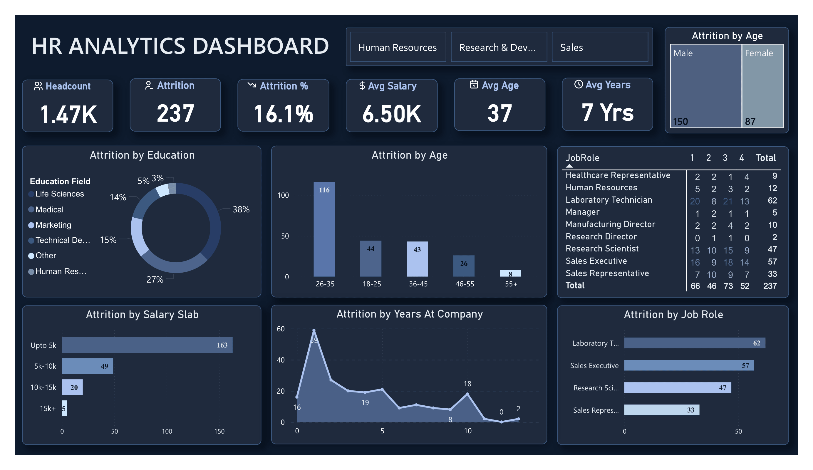

# 📊HR Analytics Dashboard -- Power BI Project

## 📌 Project Overview

This project presents an interactive **HR Analytics Dashboard** built
using **Microsoft Power BI** to analyze employee performance, attrition
trends, and workforce distribution through data-driven insights.

The dashboard provides a comprehensive overview of workforce trends and
helps HR teams make informed decisions to improve employee retention and
organizational performance.

------------------------------------------------------------------------

## 🛠 Tool Used

**Microsoft Power BI**

------------------------------------------------------------------------

## 📂 Dataset Description

-   HR employee dataset containing workforce and attrition details
-   Includes fields such as job role, department, education field, age,
    salary slab, years at company, and attrition status
-   Data cleaned and transformed using Power Query
-   DAX measures created for KPI calculations and attrition analysis

------------------------------------------------------------------------

## 📁 Project Folder Structure

    HR-Analytics-Dashboard/
    │
    ├── Dashboard/
    │   └── HR_Analytics_Dashboard.pbix
    │
    ├── Dataset/
    │   └── HR_Analytics.csv
    │
    ├── Screenshot/
    │   └── dashboard_preview.png
    │
    └── README.md

------------------------------------------------------------------------

## 📊 Dashboard 

------------------------------------------------------------------------

## 📊 Dashboard Features & KPIs

## 🔢 Key Performance Indicators (KPIs)

-   👥 **Total Headcount:** 1.47K
-   📉 **Total Attrition:** 237
-   📊 **Attrition Rate:** 16.1%
-   💰 **Average Salary:** 6.50K
-   📅 **Average Age:** 37 Years
-   ⏳ **Average Years at Company:** 7 Years

------------------------------------------------------------------------

## 📊 Charts & Visuals Explanation

### 🎓 Attrition by Education

-   Life Sciences (38%)
-   Medical (27%)
-   Marketing (15%)
-   Technical Degree (14%)
-   Other (5%)
-   Human Resources (3%)

### 👶 Attrition by Age Group

-   26--35 years (116) -- Highest
-   18--25 years (44)
-   36--45 years (43)
-   46--55 years (26)
-   55+ years (8)

### 💰 Attrition by Salary Slab

-   Upto 5k -- 163 (Highest)
-   5k--10k -- 49
-   10k--15k -- 20
-   15k+ -- 5

### ⏳ Attrition by Years at Company

Higher attrition observed in early tenure years.

### 👨‍💼 Attrition by Job Role

-   Laboratory Technician -- 62
-   Sales Executive -- 57
-   Research Scientist -- 47
-   Sales Representative -- 33

### 👥 Attrition by Gender

-   Male -- 150
-   Female -- 87

------------------------------------------------------------------------

## 🔍 Key Business Insights

-   Lower salary employees show higher attrition.
-   Employees aged 26--35 are most likely to leave.
-   Early tenure employees are at higher risk.
-   Sales and technical roles show maximum turnover.

------------------------------------------------------------------------

## 🎯 Skills Demonstrated

-   Data Cleaning & Transformation
-   Exploratory Data Analysis (EDA)
-   DAX Measure Creation
-   KPI Development
-   Dashboard Design & Data Storytelling
-   Business Insight Generation

------------------------------------------------------------------------

## 🚀 Future Enhancements

-   Implement predictive attrition modeling
-   Add employee engagement score analysis
-   Include salary and compensation analysis
-   Create drill-through detailed employee view

------------------------------------------------------------------------
## 👩‍💻 Author

**Bhawana**
Aspiring Data Analyst \| Excel • SQL • Power BI

📧 Email: bhawna.160204@gmail.com\
🔗 LinkedIn: https://www.linkedin.com/in/bhawana-12677b382/\
💻 GitHub: https://github.com/Bhawana1602
